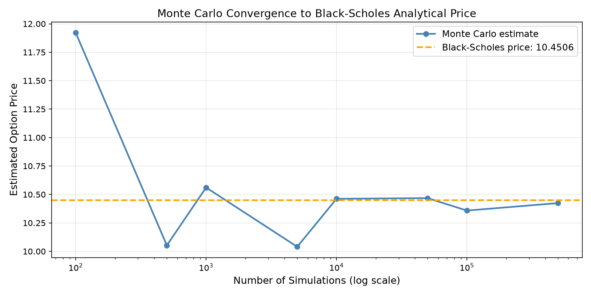
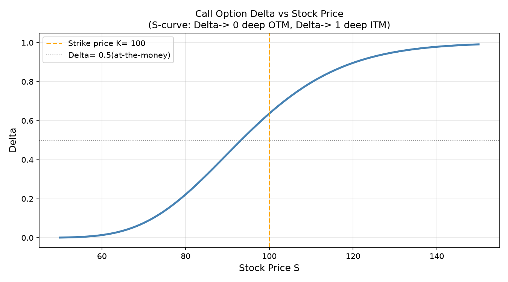
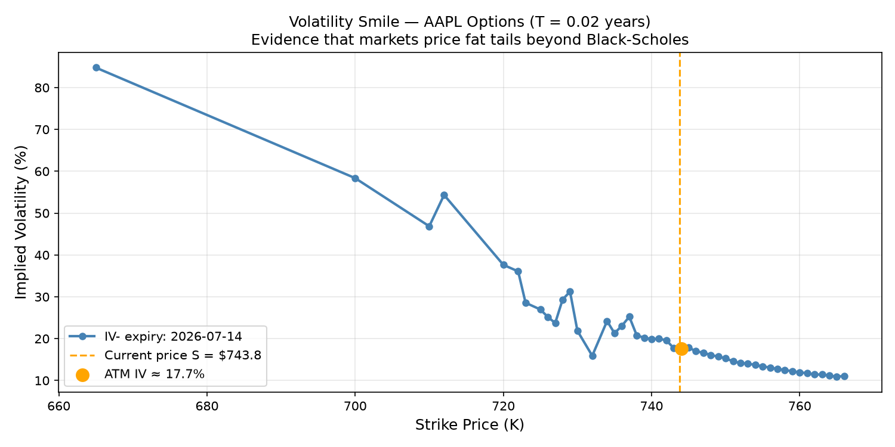
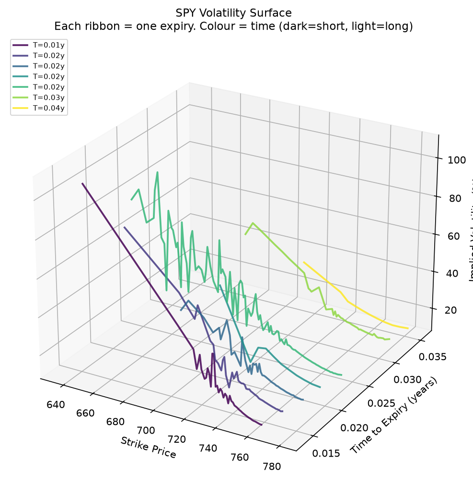

# Options Pricing Engine & Volatility Surface Analysis

## Overview

A quantitative finance project implementing European option pricing using analytical and numerical techniques. The project features Black-Scholes pricing, Monte Carlo simulation, implied volatility estimation using Brent's root-finding algorithm, analytical Greeks, volatility smile and volatility surface visualisations, and an interactive Streamlit dashboard for real-time option analysis.

**Live Demo:** https://options-pricing-engine-kaashvi.streamlit.app/

---

## Features

- **Black-Scholes Pricing** — Closed-form pricing for European call and put options
- **Monte Carlo Simulation** — Geometric Brownian Motion (GBM) based simulation with convergence analysis
- **Implied Volatility Estimation** — Market-implied volatility computed using Brent's root-finding algorithm
- **Option Greeks** — Analytical computation of Delta, Gamma, Vega, Theta, and Rho
- **Volatility Smile** — Visualisation of implied volatility across strike prices
- **Volatility Surface** — Three-dimensional implied volatility surface across strikes and maturities
- **Interactive Streamlit Dashboard** — Real-time pricing with user-defined market parameters
- **Visualisations**
  - Monte Carlo convergence
  - Delta sensitivity curve
  - Volatility smile
  - Volatility surface

---

## Mathematical Background

### Geometric Brownian Motion

The Black-Scholes model assumes that stock prices follow Geometric Brownian Motion:

```
dS = μS dt + σS dW
```

where

- **S** = Stock price
- **μ** = Expected return
- **σ** = Volatility
- **dW** = Brownian motion

---

### Black-Scholes Formula

The European call option price is given by

```
C = S·N(d₁) − K·e^(−rT)·N(d₂)
```

where

```
d₁ = [ln(S/K) + (r + σ²/2)T] / (σ√T)

d₂ = d₁ − σ√T
```

and **N(·)** denotes the cumulative standard normal distribution.

---

### Monte Carlo Pricing

Monte Carlo simulation estimates the option price by generating a large number of possible terminal stock prices according to

```
S_T = S · exp((r − 0.5σ²)T + σ√T Z)
```

where

```
Z ~ N(0,1)
```

The option payoff is computed for every simulated path, averaged, and discounted back to the present value. As the number of simulated paths increases, the estimate converges toward the analytical Black-Scholes price.

---

## Implied Volatility

Rather than assuming volatility is known, market participants infer it from observed option prices.

This project estimates implied volatility using **Brent's root-finding algorithm**, a robust numerical method that combines bisection, secant, and inverse quadratic interpolation. Unlike Newton-Raphson, Brent's method does not require derivative calculations and guarantees convergence whenever the solution is bracketed.

The algorithm repeatedly solves

```
BlackScholesPrice(σ) − MarketPrice = 0
```

until the theoretical option price matches the observed market price within a specified numerical tolerance.

---

## Results

### Sample Parameters

| Parameter | Value |
|-----------|------:|
| Stock Price (S) | 100 |
| Strike Price (K) | 100 |
| Time to Expiry (T) | 1 year |
| Risk-Free Rate (r) | 5% |
| Volatility (σ) | 20% |

### Pricing Comparison

| Method | Call Price |
|---------|-----------:|
| Black-Scholes | 10.4506 |
| Monte Carlo (1,000,000 paths) | ~10.45 ± 0.02 |

### Greeks

| Greek | Value | Interpretation |
|--------|------:|---------------|
| Delta | +0.6368 | Price sensitivity to stock price |
| Gamma | +0.0188 | Rate of change of Delta |
| Vega | +0.3753 | Sensitivity to volatility |
| Theta | -0.0142 | Time decay |
| Rho | +0.5323 | Sensitivity to interest rates |

---

## Visualisations

### Monte Carlo Convergence



*As the number of simulated paths increases, the Monte Carlo estimate converges toward the analytical Black-Scholes price, demonstrating the Law of Large Numbers.*

---

### Delta Sensitivity Curve



*Delta transitions smoothly from approximately 0 for deep out-of-the-money options to nearly 1 for deep in-the-money options, illustrating how option sensitivity changes with the underlying asset price.*

---

### Volatility Smile



*The implied volatility smile illustrates how implied volatility varies across different strike prices for a fixed maturity. Rather than remaining constant as assumed in the Black-Scholes model, implied volatility tends to be higher for deep in-the-money and out-of-the-money options, producing the characteristic "smile" observed in real markets.*

---

### Volatility Surface



*The volatility surface extends the volatility smile by plotting implied volatility across both strike prices and maturities. It provides a three-dimensional representation of market expectations and is widely used in derivatives pricing, volatility modelling, and risk management.*

---

## Streamlit Web Application

The project is deployed as an interactive Streamlit application where users can:

- Input custom market parameters
- Price European call and put options instantly
- Compare Black-Scholes and Monte Carlo prices
- Estimate implied volatility from market option prices
- Compute option Greeks
- Visualise the volatility smile
- Explore the three-dimensional volatility surface
- Experiment with different market scenarios interactively

**Live Demo:** https://options-pricing-engine-kaashvi.streamlit.app/

---

## Project Structure

```
options-pricing-engine/
│
├── black_scholes.py
├── monte_carlo.py
├── greeks.py
├── implied_volatility.py
├── volatility_smile.py
├── volatility_surface.py
├── app.py
├── main.py
├── requirements.txt
├── convergence_plot.png
├── delta_curve.png
├── volatility_smile.png
├── volatility_surface.png
└── README.md
```

> **Note:** If the volatility smile and surface are generated directly inside `app.py`, you can omit `volatility_smile.py` and `volatility_surface.py` from the project structure.

---

## Installation

Clone the repository

```bash
git clone https://github.com/<your-username>/options-pricing-engine.git
cd options-pricing-engine
```

Install the required dependencies

```bash
pip install -r requirements.txt
```

---

## Running the Project

Run the individual modules

```bash
python black_scholes.py
python monte_carlo.py
python greeks.py
python implied_volatility.py
python volatility_smile.py
python volatility_surface.py
```

Run the complete pipeline

```bash
python main.py
```

Launch the Streamlit application locally

```bash
streamlit run app.py
```

---

## Coursework Connections

This project applies concepts from:

### Probability & Stochastic Processes

- Geometric Brownian Motion
- Risk-neutral pricing
- Monte Carlo simulation

### Numerical Methods

- Brent's root-finding algorithm
- Numerical solution of nonlinear equations

### Real Analysis

- Convergence of Monte Carlo estimators
- Law of Large Numbers

### Computational Mathematics

- Vectorised NumPy computations
- Three-dimensional surface generation
- Scientific computing using SciPy

### Quantitative Finance

- Black-Scholes option pricing
- Option Greeks
- Implied volatility estimation
- Volatility smile modelling
- Volatility surface analysis
- Derivatives pricing

---

## Tech Stack

- Python
- NumPy
- SciPy
- Matplotlib
- Plotly
- Streamlit

---

## Future Improvements

- Integration with live option chain data (Yahoo Finance/NSE APIs)
- Local volatility and stochastic volatility models (Heston, SABR)
- Binomial and Trinomial pricing models
- American option pricing
- Barrier, Asian, and other exotic options
- Portfolio Greeks and risk analysis
- Automatic calibration of volatility surfaces using live market data